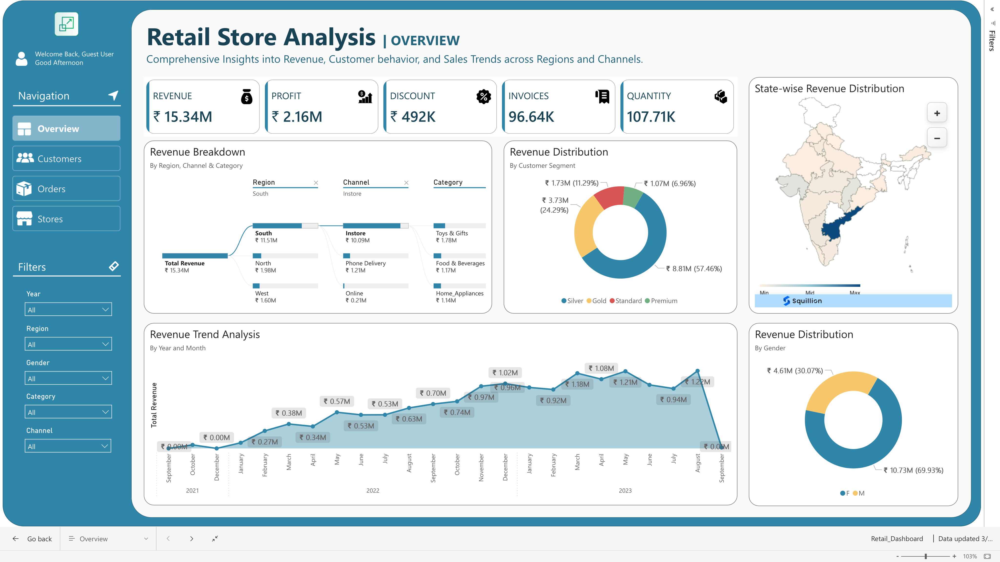

# 🛍 Retail Store Data Analysis Project

## 📌 Project Overview
This project delivers a complete **end-to-end retail store data analysis pipeline** aimed at generating actionable business insights.  
It covers **data cleaning, transformation, exploratory analysis, customer segmentation, and dashboard creation**.  
The process begins with **SQL-based preparation** and ends with **Power BI dashboards**, enabling strategic decision-making.

---

## 🎯 Objectives
- Clean and standardize raw retail data to remove discrepancies and inconsistencies.
- Build **Customer360**, **Orders360**, and **Stores360** summary tables for unified analytics.
- Conduct **descriptive** and **diagnostic** analyses to identify key trends and anomalies.
- Perform **customer behavior analysis**, **RFM segmentation**, and **cohort analysis**.
- Design **interactive dashboards** for business reporting.

---

## 🗂 Folder Structure

```
Retail-Store-Analysis/
│
├── data/                        # Raw data files
│   ├── customers.png
│   ├── orders.png
│   ├── stores.png
│   ├── payment.png
│   ├── ratings.png
│   └── products.png
│
├── sql/                         # SQL scripts
│   ├── RetailDataAudit.sql
│   ├── RetailDataCleaning.sql
│   ├── Tables360_creation.sql
│   ├── Retail_High_Level_Metrics.sql
│   ├── Retail_Data_Analysis.sql
│   └── Cohort_Analysis.sql
│
├── tables360/                 # Cleaned & aggregated data
│   ├── customer360.csv
│   ├── orders360.csv
│   └── stores360.csv
│
├── dashboards/                  
│   └── Retail_Dashboard.pbix
│
├── presentations/
│   └── Retail_Analysis_Presentation.pptx
│
├── assets/            # Logos & icons png
│      
└── README.md
```

---

## 🛠 Tools & Technologies Used
- **SQL** – Data Cleaning, Transformation, and Analysis
- **Power BI** – Data Visualization & Dashboarding
- **Power BI Service** – Publishing & Polishing Reports
- **Excel/CSV** – Data Handling
- **Analytical Techniques** – RFM Analysis, Cohort Analysis
- **Data Modeling** – Customer360, Orders360, Stores360

---

## 📊 Analysis Performed

### 1️⃣ Data Cleaning & Preparation
- Removed duplicates and null values.
- Fixed data type mismatches.
- Corrected invalid entries and inconsistent formats.
- Standardized categorical data.
- Created 360° aggregated tables.

### 2️⃣ Descriptive Analysis
- Time-series trends for sales, orders, and customers.
- Regional and store-level performance metrics.

### 3️⃣ Diagnostic Analysis
- Identified drivers for sales changes.
- Highlighted top/bottom performing products and stores.

### 4️⃣ Customer Analytics
- **RFM Segmentation** to categorize customer loyalty.
- **Cohort Analysis** for retention insights.
- Purchase behavior segmentation.

---

## 📈 Power BI Dashboards
### 1️⃣ Overview Dashboard


**What it shows:**
- KPIs: Revenue (~₹15.34M), Profit (~₹2.16M), Discount (~₹492K), Invoices (~96.64K), Quantity (~107.71K)  
- Revenue by Region, Channel, Category, Segment, State  
- Revenue Trend Analysis (Month-over-Month)  
- Revenue by Gender  

**Insights:**
- **South region** dominates revenue share (~75%)  
- **Instore** channel is the top sales driver; Online lags  
- Premium & Gold segments yield high revenue share  
- **Andhra Pradesh** is the top revenue state  
- Clear seasonal peaks in **Mar–May** with dips in Sep  

**Recommendations:**
- Expand presence in South/AP with localized campaigns  
- Improve online channel revenue via marketing & exclusive offers  
- Align discounts with profit-maximization strategies  
- Prepare for seasonal peaks with proactive inventory planning  

---

### 2️⃣ Customers Dashboard


**What it shows:**
- KPIs: Customers (~96.55K), Avg Spend ₹158.87, Avg Basket 1.12, Repeat Rate 0.04%, Avg Rating 4.10  
- Customer Segments (Standard, Silver, Gold, Premium)  
- New Customer Acquisition Trends  
- Spend & Ratings by Segment  
- Discount Seeker Distribution  

**Insights:**
- Extremely low **repeat rate** (~0.04%)  
- Premium/Gold customers spend the most & rate highest  
- ~40% are **discount seekers**  
- Segment distribution skewed toward lower-value tiers  

**Recommendations:**
- Launch loyalty program with tiered benefits  
- Implement early customer engagement strategy post-first purchase  
- Target discounts toward price-sensitive customers only  
- Focus retention strategies on high-value segments  

---

### 3️⃣ Orders Dashboard


**What it shows:**
- KPIs: Orders (~96.64K), Avg Order Value ₹158.73, Avg Basket 1.11, Avg Discount % 3.21%, Preferred Pay Method: Credit Card, Avg Rating 4.08  
- AOV by Day, Time, and Channel  
- Order Distribution by Category  
- Order Heatmap by Day vs Time Slot  

**Insights:**
- Highest AOV during **Evenings & Instore purchases**  
- Orders cluster **Afternoon/Evening** mid-week  
- Online channel has the lowest AOV & ratings  
- Few categories dominate order share  

**Recommendations:**
- Run **time-slot promotions** in evening peak hours  
- Enhance online shopping UX to improve conversion  
- Promote diverse payment methods with incentives  
- Cross-sell/upsell during off-peak time slots  

---

### 4️⃣ Stores Dashboard


**What it shows:**
- KPIs: 37 Stores, Avg Revenue ₹414.55K, Avg Orders 2.61K, Avg Profit % 14.11%, % Discount Orders 40.49%, Preferred Channel: Instore  
- AOV vs Rating by Category  
- Revenue by Channel & State  
- Top 10 Stores by Performance Metrics  
- Revenue by Region  

**Insights:**
- Revenue is **concentrated** in top-performing stores (ST103 ≈ 40.6%)  
- Profitability impacted by discount intensity  
- South leads regionally; West & North underperform  
- High ratings overall but slightly lower where deep discounts applied  

**Recommendations:**
- Replicate top-performing store strategies across others  
- Reduce blanket discounting; move to targeted promotions  
- Explore expansion in South; investigate underperformance in West/North  
- Increase multi-channel fulfillment to boost sales without heavy discounting  

---

## 📈 Overall Business Insights
- South & Instore are main revenue drivers; Online needs growth push  
- Premium & Gold customers are more valuable; extremely low repeat rate is a risk/opportunity  
- Evening sales slots deliver higher AOV – should be leveraged  
- Discount strategies must shift toward **precision targeting** to protect margins  

---

## 🚀 How to Use
1. Clone the repository:
   ```bash
   git clone https://github.com/Dipesh-Ydv/Retail-Store-Data-Analysis.git
   ```
2. Open SQL scripts in an SQL editor to review queries.
3. Load `Retail_Dashboard.pbix` in Power BI Desktop.
4. Review the presentation for a complete walkthrough.

---

## 📄 Project Presentation
A detailed presentation includes:
- Business Overview & Problem Statement
- Data Dictionary
- Cleaning Steps
- Analysis & Insights
- Dashboard Walkthrough

Location:  
```
presentations/Retail_Analysis_Presentation.pptx
```

---

## 🏆 Skills Demonstrated
- SQL Data Cleaning & Preparation
- Data Modeling & Aggregation
- Exploratory Data Analysis (EDA)
- Power BI Dashboard Development
- Customer Segmentation
- Data Storytelling

---

## 📬 Contact
**Dipesh Yadav**  
📧 Email: dipeshyadav4444@gmail.com  
🔗 LinkedIn: https://linkedin.com/in/dipesh-yadav-datascientist  
💻 GitHub: https://github.com/Dipesh-Ydv
